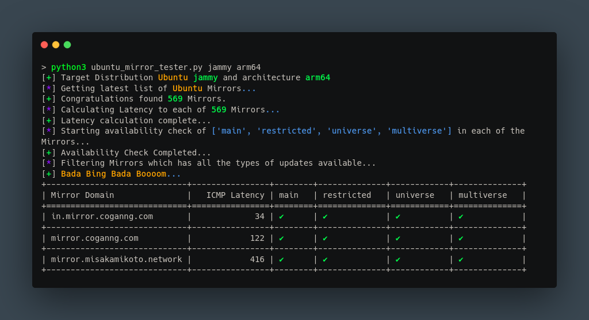
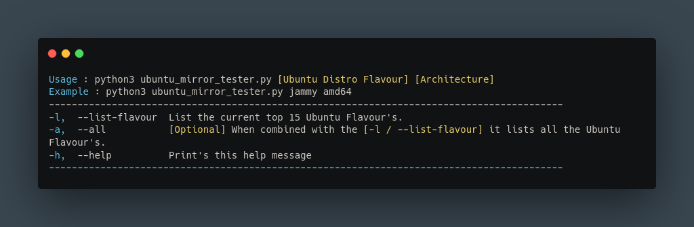

# 🤔 What is this?
#### This is a python script which list's all the mirror's of Ubuntu and sorts them by lowest latency(ICMP) first which contains all the repo contents[main, restricted, universe, multiverse].



# ✨ Features
- Find and list all the latest up-to-date ubuntu os version's and flavour nicknames.
- List's all the Ubuntu mirror's from the launchpad.net
- Sort's all the Ubuntu mirror's by the lowest latency found via averaging 3 ICMP reply's.
- Check's availability of all repo's like [main, restricted, universe, multiverse].
- Doesn't use Java... :)


# Installation
```bash
sudo apt install python3 python3-pip
git clone https://github.com/Xyan1d3/ubuntu_mirror_tester.git
cd ubuntu_mirror_tester/
pip3 install -r requirements.txt
```

# Usage
```c
> python3 ubuntu_mirror_tester.py jammy arm64
[+] Target Distribution Ubuntu jammy and architecture arm64                                                                                                              
[*] Getting latest list of Ubuntu Mirrors...                                        
[+] Congratulations found 569 Mirrors.                                              
[*] Calculating Latency to each of 569 Mirrors...                                   
[+] Latency calculation complete...                                                 
[*] Starting availability check of ['main', 'restricted', 'universe', 'multiverse'] in each of the Mirrors...
[+] Availability Check Completed...                                                 
[*] Filtering Mirrors which has all the types of updates available...               
[+] Bada Bing Bada Boooom...                                                        
+-----------------------------+----------------+--------+--------------+------------+--------------+
| Mirror Domain               |   ICMP Latency | main   | restricted   | universe   | multiverse   |
+=============================+================+========+==============+============+==============+
| in.mirror.coganng.com       |             34 | ✔      | ✔            | ✔          | ✔            |
+-----------------------------+----------------+--------+--------------+------------+--------------+
| mirror.coganng.com          |            122 | ✔      | ✔            | ✔          | ✔            |
+-----------------------------+----------------+--------+--------------+------------+--------------+
| mirror.misakamikoto.network |            416 | ✔      | ✔            | ✔          | ✔            |
+-----------------------------+----------------+--------+--------------+------------+--------------+
```